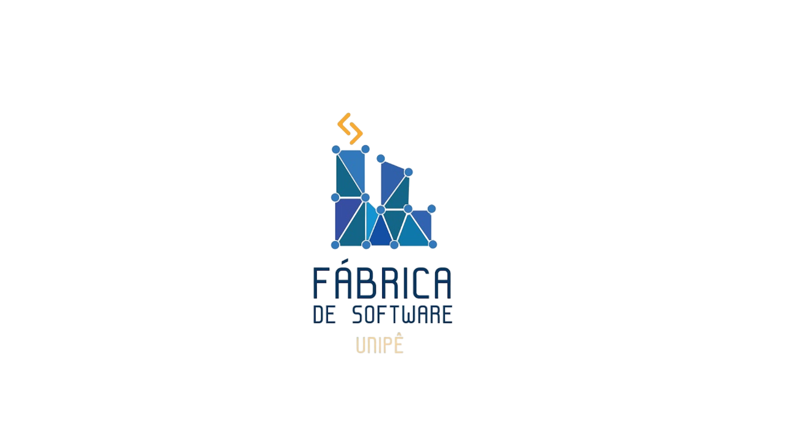

<h1 align="center">
    
    Workshop Frontend 2025.1
</h1>

## 🚨About

This is a simple project based on Pokemon TCG that consists of 3 pages, where the first has a slider with random cards, the second has a card gallery and on the third you can open a pack of cards.

## 🔨Tools

- [Node](https://nodejs.org)
- [React Js](https://react.dev/)
- [Next Js](https://nextjs.org/)

## Getting Started

First, run the development server:

```bash
# Clone the project
$ git clone https://github.com/GabrielSousaM/workshop-frontend-2025.1.git
```
```bash
# Enter directory
npm cd workshop-frontend-2025.1
```

```bash
# Install the dependencies, if use npm
npm install
```